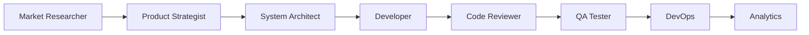

# Claude CLI Agent Configuration for Trading App

## Project Overview
This document defines the agent architecture for developing a Flutter trading app using Claude CLI. Each agent has specific responsibilities and can be invoked independently or work collaboratively.

## Agent Definitions

### 1. Market Research Agent (`market-researcher`)
**Purpose**: Analyze market trends, competitor apps, and user preferences to guide product development.

**Responsibilities**:
- Research existing trading signal apps from Apple app store (Stock alert, Signal, Stock Alarm, etc)
- Identify unique selling propositions and market gaps
- Analyze user reviews and pain points
- Track regulatory requirements for different regions
- Monitor trending features and UI/UX patterns
- Provide competitive pricing strategy

**Key Outputs**:
- Competitor analysis reports
- Feature prioritization matrix
- User persona definitions
- Market opportunity assessments

**MCP Requirements**: None (uses web search and analysis)

**Claude CLI Invocation**:
```bash
claude chat --agent market-researcher "Analyze top 5 trading apps and identify features we should prioritize"
```

---

### 2. Product Strategist Agent (`product-strategist`)
**Purpose**: Define product roadmap, platform strategy, and distribution channels.

**Responsibilities**:
- Determine MVP features vs. future releases
- Decide on platform strategy (iOS first, Android first, or simultaneous)
- Evaluate alternative distribution channels:
  - Native mobile apps (iOS/Android)
  - Progressive Web App (PWA)
  - Chrome extension for quick trades
  - Desktop application (Electron)
  - API for third-party integrations
- Define monetization strategy
- Create product variants (Lite vs. Pro versions)

**Key Outputs**:
- Product roadmap
- Platform distribution strategy
- Feature flag configuration
- A/B testing strategies

**MCP Requirements**: None

**Claude CLI Invocation**:
```bash
claude chat --agent product-strategist "Should we build a Chrome extension companion to our mobile app?"
```

---

### 3. System Architect Agent (`system-architect`)
**Purpose**: Design technical architecture, define APIs, and ensure scalability.

**Responsibilities**:
- Design microservices architecture
- Define API contracts and data models
- Plan real-time data streaming architecture
- Design authentication and security layers
- Establish caching strategies
- Plan database schema (PostgreSQL for transactions, Redis for real-time)
- Define WebSocket strategy for live prices
- Design event-driven architecture for order processing

**Key Outputs**:
- System architecture diagrams
- API specifications (OpenAPI/Swagger)
- Database schemas
- Infrastructure requirements
- Security architecture

**MCP Requirements**: 
- File system access for diagram generation
- Database schema tools (optional)

**Claude CLI Invocation**:
```bash
claude chat --agent system-architect "Design WebSocket architecture for real-time price updates"
```

---

### 4. Developer Agent (`developer`)
**Purpose**: Implement features, write code, and build the application.

**Responsibilities**:
- Implement Flutter UI components
- Integrate REST APIs and WebSockets
- Implement state management (Provider/Riverpod/Bloc)
- Write business logic and algorithms
- Implement chart libraries and data visualization
- Handle offline functionality and data sync
- Implement push notifications
- Build authentication flows

**Key Outputs**:
- Flutter/Dart code
- API integration code
- Unit tests
- Widget implementations
- State management logic

**MCP Requirements**:
- File system access for code generation
- Git integration for version control

**Claude CLI Invocation**:
```bash
claude chat --agent developer "Implement real-time portfolio value calculation with WebSocket updates"
```

---

### 5. Code Reviewer Agent (`code-reviewer`)
**Purpose**: Review code quality, security, and best practices.

**Responsibilities**:
- Review code for Flutter/Dart best practices
- Check security vulnerabilities
- Ensure proper error handling
- Validate state management patterns
- Review API integration security
- Check for memory leaks and performance issues
- Ensure accessibility compliance
- Validate responsive design implementation

**Key Outputs**:
- Code review comments
- Security audit reports
- Performance recommendations
- Refactoring suggestions

**MCP Requirements**:
- File system access for code analysis
- Git integration for PR reviews

**Claude CLI Invocation**:
```bash
claude chat --agent code-reviewer "Review the order placement module for security issues"
```

---

### 6. DevOps Agent (`devops`)
**Purpose**: Handle CI/CD, deployment, and infrastructure.

**Responsibilities**:
- Set up GitHub Actions for CI/CD
- Configure Fastlane for automated deployments
- Manage code signing and certificates
- Set up staging and production environments
- Configure monitoring and logging (Sentry, Firebase Crashlytics)
- Implement feature flags (Firebase Remote Config)
- Set up A/B testing infrastructure
- Configure CDN for static assets
- Implement automated testing pipelines

**Key Outputs**:
- CI/CD pipeline configurations
- Deployment scripts
- Docker configurations
- Kubernetes manifests
- Infrastructure as Code (Terraform)

**MCP Requirements**:
- File system access
- Docker integration
- Cloud provider APIs (optional)

**Claude CLI Invocation**:
```bash
claude chat --agent devops "Set up GitHub Actions for automated App Store deployment"
```

---

### 7. QA Agent (`qa-tester`)
**Purpose**: Design and execute test strategies.

**Responsibilities**:
- Create test plans and test cases
- Write integration tests
- Design E2E test scenarios
- Performance testing strategies
- Security testing procedures
- Accessibility testing
- Cross-platform compatibility testing
- Load testing for backend services

**Key Outputs**:
- Test plans
- Automated test scripts
- Bug reports
- Test coverage reports
- Performance benchmarks

**MCP Requirements**:
- File system access for test scripts

**Claude CLI Invocation**:
```bash
claude chat --agent qa-tester "Create E2E test for complete trade execution flow"
```

---

### 8. Analytics Agent (`analytics`)
**Purpose**: Track user behavior and optimize product based on data.

**Responsibilities**:
- Implement analytics tracking (Firebase, Mixpanel)
- Define KPIs and success metrics
- Track user engagement and retention
- Monitor feature adoption rates
- Analyze trading patterns and user preferences
- A/B test results analysis
- Revenue attribution tracking
- Crash and performance monitoring

**Key Outputs**:
- Analytics implementation code
- Dashboard configurations
- User behavior reports
- Feature performance metrics
- Revenue analysis

**MCP Requirements**:
- Analytics platform APIs (optional)

**Claude CLI Invocation**:
```bash
claude chat --agent analytics "Design event tracking for user onboarding funnel"
```

---

### 9. Compliance Agent (`compliance`)
**Purpose**: Ensure regulatory compliance and security standards.

**Responsibilities**:
- FINRA compliance requirements
- SEC regulations adherence
- GDPR/CCPA data privacy compliance
- KYC/AML implementation guidelines
- Data encryption standards
- Audit trail requirements
- Terms of Service and Privacy Policy
- App Store compliance guidelines

**Key Outputs**:
- Compliance checklists
- Privacy policy templates
- Security requirements
- Audit documentation

**MCP Requirements**: None

**Claude CLI Invocation**:
```bash
claude chat --agent compliance "What KYC requirements do we need for US users?"
```

---

## Agent Collaboration Workflows

### Feature Development Workflow


### Example Multi-Agent Session
```bash
# Research phase
claude chat --agent market-researcher "What features do users want most in trading apps?"

# Architecture phase
claude chat --agent system-architect "Design order matching system architecture"

# Development phase
claude chat --agent developer "Implement limit order functionality"

# Review phase
claude chat --agent code-reviewer "Review the limit order implementation"

# Deployment phase
claude chat --agent devops "Deploy to TestFlight for beta testing"
```

## MCP (Model Context Protocol) Configuration

### Agents Requiring MCP
1. **System Architect** - For generating and updating architecture diagrams
2. **Developer** - For file system access and code generation
3. **Code Reviewer** - For accessing and reviewing code files
4. **DevOps** - For deployment scripts and configuration files
5. **QA Tester** - For test script generation and execution

### MCP Setup Example
```json
{
  "mcpServers": {
    "filesystem": {
      "command": "npx",
      "args": ["@modelcontextprotocol/server-filesystem", "/path/to/project"],
      "agents": ["developer", "code-reviewer", "devops", "qa-tester"]
    },
    "git": {
      "command": "npx",
      "args": ["@modelcontextprotocol/server-git"],
      "agents": ["developer", "code-reviewer", "devops"]
    }
  }
}
```

## Project Structure for Claude CLI

```
trading-app/
├── .claude/
│   ├── agents/
│   │   ├── market-researcher.md
│   │   ├── product-strategist.md
│   │   ├── system-architect.md
│   │   ├── developer.md
│   │   ├── code-reviewer.md
│   │   ├── devops.md
│   │   ├── qa-tester.md
│   │   ├── analytics.md
│   │   └── compliance.md
│   └── claude.json
├── docs/
│   ├── architecture/
│   ├── api-specs/
│   └── compliance/
├── src/
│   └── flutter-app/
├── tests/
├── ci-cd/
└── README.md
```

## Getting Started

1. **Initialize Claude CLI in your project**:
```bash
cd trading-app
claude init
```

2. **Configure agents** by creating `.claude/claude.json`:
```json
{
  "project": "trading-app",
  "agents": {
    "market-researcher": {
      "description": "Market research and competitive analysis",
      "context": ["docs/market-research/"]
    },
    "developer": {
      "description": "Flutter app development",
      "context": ["src/", "pubspec.yaml"],
      "mcp": ["filesystem", "git"]
    },
    "code-reviewer": {
      "description": "Code quality and security review",
      "context": ["src/", "tests/"],
      "mcp": ["filesystem", "git"]
    }
  }
}
```

3. **Start development**:
```bash
# Start with market research
claude chat --agent market-researcher "Analyze Robinhood's key features"

# Move to development
claude chat --agent developer "Create portfolio dashboard screen"

# Review code
claude chat --agent code-reviewer "Review portfolio dashboard implementation"
```

## Best Practices

1. **Sequential Agent Usage**: Follow the workflow order for new features
2. **Context Sharing**: Save important outputs from one agent to share with others
3. **Iterative Development**: Use agents iteratively, not just once
4. **Documentation**: Have each agent document their decisions
5. **Version Control**: Commit after each major agent contribution

## Advanced Usage

### Chaining Agents
```bash
# Chain multiple agents for complex tasks
claude chat --chain "market-researcher,product-strategist,developer" \
  "Build a YOLO trading feature based on market demand"
```

### Parallel Agent Execution
```bash
# Run multiple agents in parallel for different modules
claude chat --parallel \
  --agent developer "Build order module" \
  --agent qa-tester "Write tests for portfolio module"
```

## Success Metrics

Track these metrics to measure agent effectiveness:
- Code review findings per 1000 lines
- Feature development velocity
- Bug detection rate in QA phase
- Deployment success rate
- User satisfaction scores
- Compliance audit pass rate

## Continuous Improvement

1. **Weekly Reviews**: Review agent performance and adjust contexts
2. **Feedback Loop**: Incorporate user feedback into market-researcher agent
3. **Agent Evolution**: Update agent instructions based on lessons learned
4. **Knowledge Sharing**: Document patterns that work well across agents

---

*Last Updated: [Current Date]*
*Version: 1.0*
*Maintained by: Trading App Development Team*